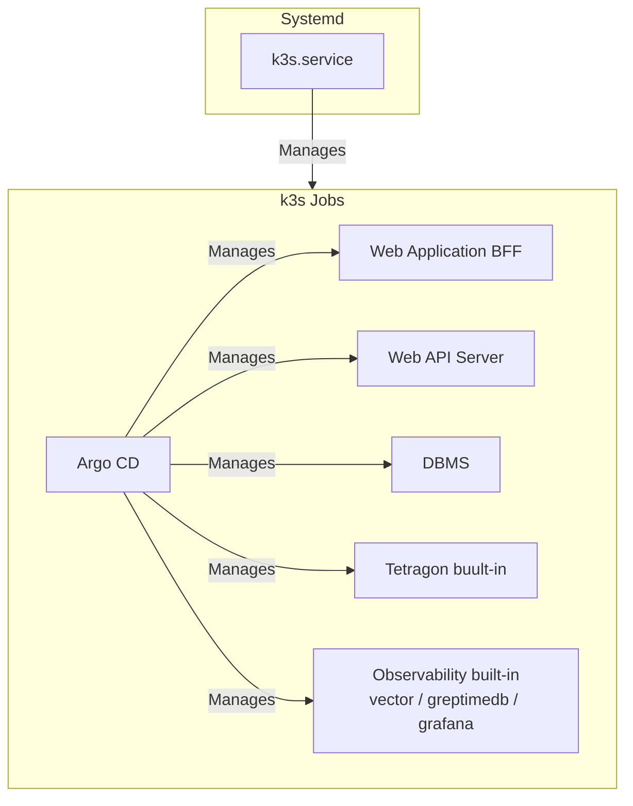

# sakura-flatcar-k3s-argocd-iac
さくらのクラウド上に Flatcar Container Linux, k3s, ArgoCD をインストールする

## アーキテクチャ

- さくらのクラウド上に構築する
- OS には Flatcar を使用する
- 3台のサーバでクラスタを構成する
- クラスタのミドルウェアとして k3s を使用する
- 3台のサーバをコントロールプレーン兼ワーカとしてセットアップする
- クラスタのサーバ間通信のための内部ネットワークを運用する
- k3s に Argo CD を入れて、 Helm チャートを管理する
- ロードバランサを使用してグローバルIPで着信した HTTP リクエストをサービスが動作しているワーカに振り分ける
- ロードバランサの設定をコントローラから行うさくらのクラウド用 CCM を開発してインストールする
- eBPF として Tetragon を導入する
- ログの解析のために vector, greptimeDB, grafana を導入する

## 構築ツール

IaC のツールとしては、Terraform と Ignition(Butane) を使用する。Codespace でこのリポジトリを開き、`setup.py` で構築する。


### 事前準備

サービスを公開するDNSのサブドメインを DigitalOcean DNS に委任する。具体的には NS レコードで ns1.digitalocean.com, ns2.digitalocean.com を指定する。

### パラメータ

パラメータはすべて Codespace の環境変数から取得する。以下にパラメータの一覧を示す。

|環境変数名|意味|例|デフォルト/必須|
|--|--|--|--|
|SAKURA_ACCESS_TOKEN|さくらのクラウドのAPIキーのアクセストークン|23DF..X14|必須|
|SAKURA_ACCESS_TOKEN_SECRET|さくらのクラウドのAPIキーのアクセストークンのシークレット|23DF..X14|必須|
|DO_PAT|DigitalOcean API の Personal Access Token|Dop..|必須|
|SAKURA_LABEL_PREFIX|サーバのラベルのプリフィックス。この後ろに -sv1, -sv2, -sv3 を結合してサーバのラベルを付与する。これはホスト名と一致させる。|ops-frontier|ops-frontier|
|SAKURA_REGION|さくらのクラウドの配置先リージョン。|is1c|is1c|
|SAKURA_SERVER_CPU|さくらのクラウドのサーバのCPU数|4|2|
|SAKURA_SERVER_MEMORY|さくらのクラウドのサーバのメモリサイズ(GB)|8|4|
|SAKURA_SERVER_COMMITMENT|さくらのクラウドのサーバの占有度|dedicatedcpu|standard|
|SAKURA_SERVER_CPU_MODEL|さくらのクラウドのサーバのCPUモデル|amd_epyc_7713p|uncategorized|
|DOMAIN|DigitalOcean DNS に委譲されるドメイン|v2v.chip-in.net|必須|
|LE_ENVIRONMENT|Let's Encrypt の環境 (production または staging)|staging|production|
|GH_ORGANIZATION|Github の組織のID |ops-frontier|chip-in-v2|
|GH_CLIENT_ID_GRAFANA|Github ClientID Grafana用||必須|
|GH_CLIENT_SECRET_GRAFANA|Github Secret Grafana用||必須|
|GH_CLIENT_ID_ARGOCD|Github ClientID ArgoCD用||必須|
|GH_CLIENT_SECRET_ARGOCD|Github Secret ArgoCD用||必須|
|AUTO_SHUTDOWN_UTC|毎日自動シャットダウンする時刻 (UTC)。systemd OnCalendar 形式 (例: `11:00:00` = 20:00 JST)。未設定の場合は自動シャットダウンなし。|11:00:00|なし|

なお、環境変数は CodeSpaces から設定できるようにするため、大文字でなければならない。terraform で利用する変数については TF_VAR_ で始まる環境変数に  postCreateCommand で転記する。

### サーバとネットワーク

terraform でサーバを3台を SAKURA_REGION で指定されたリージョンに構築する。各サーバには以下の2枚のディスクを接続する。

- **ブートストラップディスク (20GB)**: Ubuntu 22.04 LTS パブリックアーカイブから作成。ディスク修正 API でグローバル IP と SSH 公開鍵を設定して起動する。Flatcar のインストール作業環境として使用する。
- **ターゲットディスク (40GB)**: 未フォーマットの SSD。`flatcar-install` で Flatcar Container Linux をインストールする先。

さくらのクラウドの API でディスクの順序を入れ替えることで、Ubuntu と Flatcar のどちらから起動するかを選択できる。これにより、サーバを再構築せずに Ignition 設定をデバッグできる。

セキュリティ向上のため、さくらのクラウドのパケットフィルタを構成し、サーバのパブリックIPには**ポート 80 (HTTP) と 443 (HTTPS) のみ**オープンにするようにアクセス制限をかける。SSH接続はデフォルトでは許可されない。

### ssh

ssh のペア鍵は terraform でオンデマンドに生成する。`setup.py build-infra` が以下を自動的に行う。

1. 開発環境からインターネットに接続するときのグローバルIPを調べる
2. パケットフィルタで 22 番ポートの tcp 接続を開発環境の IP のみ許可する
3. `~/.ssh/config` を生成し、サーバ名でアクセスできるようにする

config では `${SAKURA_LABEL_PREFIX}-sv1`, `${SAKURA_LABEL_PREFIX}-sv2`, `${SAKURA_LABEL_PREFIX}-sv3` のホスト名でアクセスできるようにする。

### 初期インストール

初期インストールは Flatcar Container Linux でデフォルトでサポートされている Ignition を使用する。Ignition の内容については Butane を使用して [YAML](./butane/node.yaml.tpl) で記述する。`setup.py boot` がテンプレートから各サーバ用の Ignition ファイルを生成し、Ubuntu 上で `flatcar-install` を実行してターゲットディスクにインストールする。インストール完了後、ディスク順序を入れ替えて Flatcar から起動する。

### ミドルウェア

サーバに k3s を systemd 管理のサービスとしてインストールする。k3s でクラスタを構成し、コンテナのオーケストレーションを行う。

- 全サーバをコントロールプレーン兼ワーカノードとする
- Embeded DB を全サーバにインストールしクラスタ化する
- k3s のHelmチャート管理には Argo CD を使用する



### Helmチャート管理

Argo CD を導入して Helm チャートを管理する。 Helm チャートはインフラ層には稼働監視と eBPF が組み込みチャートとしてインストールされる。
組み込みチャートはさくらインターネットのコンテナレジストリに登録される。チャート登録用のコンテナレジストリは terraform によって作成される。
コンテナレジストリのユーザも terrafom によって作成される。
Argo CD を動作させる前に稼働監視とeBPF のチャートをビルドし、コンテナレジストリに push しておく。ArgoCDにはコンテナレジストリのタグを登録する。登録後 OCI でチャートを pull して初期化する。

### 稼働監視

稼働監視のための vector / greptimedb / grafana が組み込まれており、障害検知、フォレンジックに利用可能である。

#### 解析と蓄積

vector でログとメトリックスを集めて稼働監視を行う。
- ログの解析のために vector, greptimeDB, grafana を導入する
- vector は containerd、k3sデーモンを含むOSレベルのログ、Tetragon のログ、各コンテナのログを収集する
- ログを出力するデーモン、コンテナはできる限り JSON フォーマットのログを出力するように設定する
- grafana のダッシュボードには各種ログを俯瞰できるものを掲載する
- grafana には admin ユーザを環境変数で指定したパスワードで登録しておく
- vector, greptimedb, grafana の設定情報は Helmチャートの ConfigMap から収集され、コントローラによって動的に構成される

### eBPF
eBPF の Tetragon が組み込まれており、サーバでシステムコールレベルの監視を行う。
Tetragonのログを稼働監視で収集できるように Chart の ConfigMap に vector, greptimeDB, grafana の設定を入れる。稼働監視のコントローラでこれを発見してオンデマンドでログが収集されるようにする。

### アップデート

- OS については Flatcar Conatainer Linux の Automated update を使用して行う
- k3s については Rancher（SUSE）の公式ツールである System Upgrade Controller（SUC） をKubernetesクラスタ内にデプロイして更新する
- OS と k3s の更新のタイミングを揃えることでセキュリティパッチのためのコンテナ再起動回数を最小限にする

## 構築手順

### 1. 事前準備（サービスのサインアップとパラメータ収集）

本手順を開始する前に、以下のサービスへの登録と設定値の取得が必要です。

1. **さくらのクラウド**
   - アカウントを作成し、課金設定を完了します。
   - [API キー](https://secure.sakura.ad.jp/cloud/?#/apikeys) から API キーを生成し、その鍵とシークレットを控えておきます。
   - 委譲するドメイン名 (`DOMAIN`) を決定します (例: `coder.example.com` など)。
2. **DNS の設定**
   - DigitalOcean の管理画面（DNS）にアクセスし、該当のドメイン (`DOMAIN`) を新しく追加します。
   - 取得または管理しているドメインのレジストラ（お名前.com, Route53, Cloudflare等）の設定画面を開きます。
   - 利用するサブドメインのネームサーバー（NSレコード）として、以下の DigitalOcean DNS サーバーを向くように権限委譲を設定します。

     - `ns1.digitalocean.com`
     - `ns2.digitalocean.com`

3. **GitHub OAuth アプリケーションの作成**
   - GitHub の `Settings` > `Developer settings` > `OAuth Apps` に移動します。
   - ArgoCD 用の `New OAuth App` を作成します。
     - Homepage URL: `https://argocd.${DOMAIN}` (例: `https://argocd.example.com`)
     - Authorization callback URL: `https://argocd.${DOMAIN}/api/dex/callback`
   - 生成された **Client ID** を `GH_CLIENT_ID_ARGOCD`、**Client Secret** を `GH_CLIENT_SECRET_ARGOCD` として控えます。
   - Grafana 用の `New OAuth App` を作成します。
     - Homepage URL: `https://grafana.${DOMAIN}` (例: `https://grafana.example.com`)
     - Authorization callback URL: `https://grafana.${DOMAIN}/login/github`
   - 生成された **Client ID** を `GH_CLIENT_ID_GRAFANA`、**Client Secret** を `GH_CLIENT_SECRET_GRAFANA` として控えます。

### 2. GitHub Codespaces の起動と環境変数設定

1. 対象のリポジトリ（本リポジトリ）の Settings ページから `Secrets and variables` > `Codespaces` を開き、以下の環境変数 (Secrets) を登録します。

   - `SAKURA_ACCESS_TOKEN`: さくらのクラウド API キーのアクセストークン (必須)
   - `SAKURA_ACCESS_TOKEN_SECRET`: さくらのクラウド API キーのアクセストークンのシークレット (必須)
   - `DO_PAT`: DigitalOcean API トークン (必須)
   - `DOMAIN`: 委譲したドメイン名 (必須。例: `example.com`)
   - `GH_CLIENT_ID_ARGOCD`: GitHub OAuth アプリの Client ID (必須)
   - `GH_CLIENT_SECRET_ARGOCD`: GitHub OAuth アプリの Client Secret (必須)
   - `GH_CLIENT_ID_GRAFANA`: GitHub OAuth アプリの Client ID (必須)
   - `GH_CLIENT_SECRET_GRAFANA`: GitHub OAuth アプリの Client Secret (必須)
   - (その他、Readme上部の「パラメータ」表にある値を必要に応じて設定)

2. リポジトリの画面に戻り、`Code` > `Codespaces` から新しい Codespace を起動します。
   - `.devcontainer/devcontainer.json` に基づいて自動的に Terraform や k3s がインストールされた環境が立ち上がります。
   - 上記で設定した環境変数は、すべて `TF_VAR_` プレフィックスが付与されて Terraform 用の変数として自動認識されます。

### 3. Terraform 初期化
```bash
cd terraform && terraform init && cd ..
```

### 4. インフラ構築

Ubuntu サーバのプロビジョニング、SSH パケットフィルタの設定、`flatcar-install` のインストールを行う。

```bash
./setup.py build-infra
```

### 5. Flatcar Linux のインストールと起動

各サーバに Ignition ファイルを生成して Flatcar をインストールし、再起動する。k3s と ArgoCD は起動後に自動インストールされる。

```bash
./setup.py boot
```

### 6. クラスタの確認

インストールには数分かかる。

```bash
ssh core@<SAKURA_LABEL_PREFIX>-sv1
sudo journalctl -u install-k3s.service -f     # k3s インストールログ
sudo journalctl -u install-argocd.service -f  # ArgoCD インストールログ (sv1 のみ)
```

ArgoCD の Pod が起動していることを確認する。

```bash
export KUBECONFIG=/etc/rancher/k3s/k3s.yaml
kubectl get pods -n argocd
kubectl get nodes
```

### 7. ArgoCD ブートストラップ (install-charts)

YAML テンプレートをレンダリングし、`~/.kube/config` を設定した上で ArgoCD に App of Apps と各種マニフェストを適用する。このコマンドは Codespace から実行する。

```bash
./setup.py install-charts
```

実行内容:
1. `argocd/manifests/*.yaml.tpl` および `argocd/apps/infra-apps.yaml.tpl` を `rendered/` にレンダリング
2. sv1 から kubeconfig を取得して `~/.kube/config` に保存 (context: `sakura-k3s`)
3. 以下のマニフェストを `kubectl apply`:
   - `rendered/bootstrap.yaml` — ArgoCD AppProject + App of Apps
   - `rendered/infra-apps.yaml` — cert-manager / traefik / tetragon 等の Application 定義
   - `rendered/argocd-config.yaml` — GitHub OAuth + Ingress 設定
   - `rendered/cert-manager-issuers.yaml` — Let's Encrypt ClusterIssuer + DigitalOcean DNS トークン
   - `rendered/grafana-oauth-secret.yaml` — Grafana GitHub OAuth Secret

適用後は ArgoCD が cert-manager / traefik / tetragon などを自動デプロイする。進捗は以下で確認できる。

```bash
export KUBECONFIG=~/.kube/config
kubectl get applications -n argocd
kubectl get pods -n cert-manager
kubectl get pods -n traefik
```

### 8. SSH アクセスの無効化（オプション）

作業完了後、SSH のパケットフィルタルールを削除してセキュリティを強化する。

```bash
./setup.py deny-ssh
```

### インフラの削除

```bash
./setup.py destroy
```

